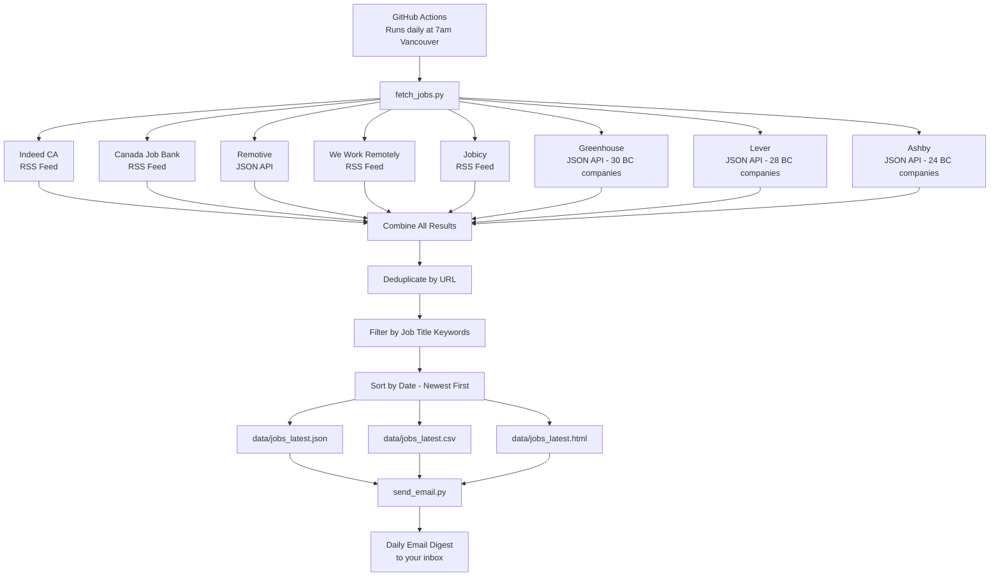
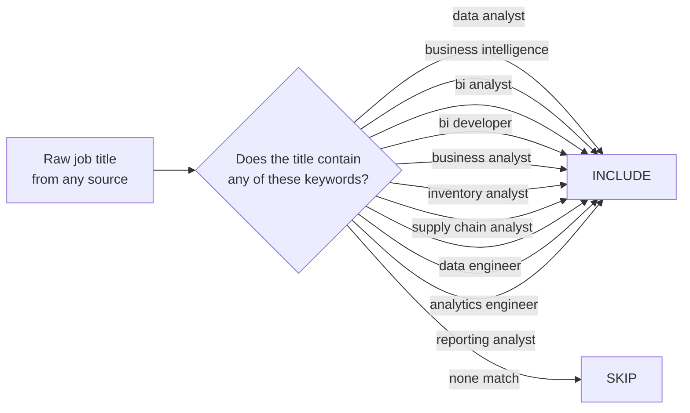
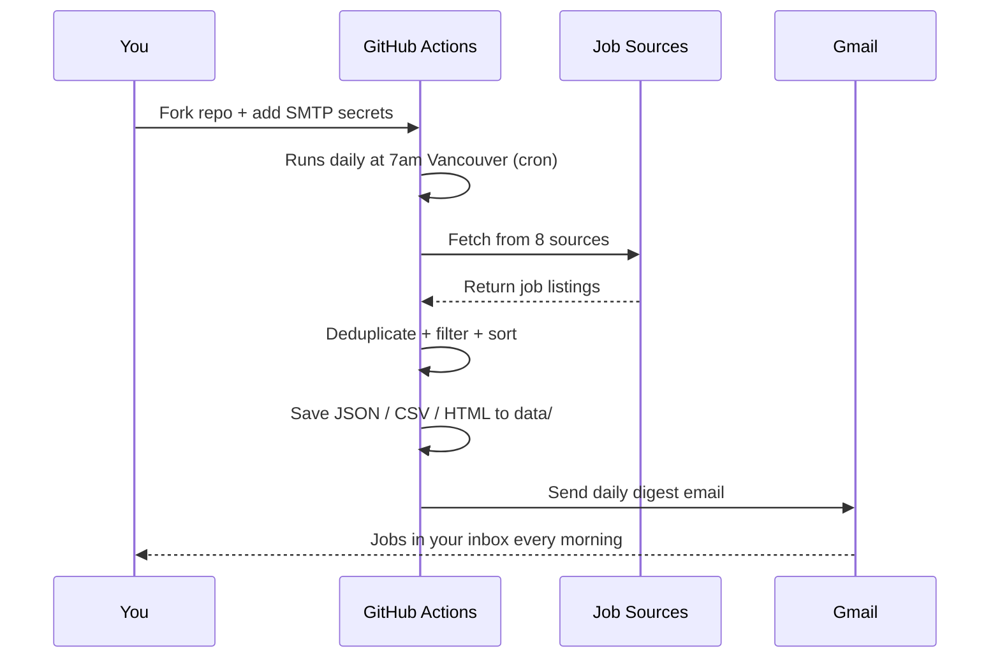

# Data Analyst Job Search Aggregator

A fully automated, free job feed aggregator built specifically for **Data Analysts** — not data scientists, not engineers. This tool pulls job postings daily from 8 different sources, deduplicates them, filters by relevant titles, and delivers a clean digest to your inbox every morning.

> Built by a data analyst, for data analysts. Most open-source job scrapers on GitHub target ML/data science roles. This one is tuned for BI, analytics, supply chain, and business analyst roles — the titles that actually match a data analyst's background.

---

## How It Works — Overview



---

## Title Keyword Filter



---

## What It Does

Every day at 7:00 AM Vancouver time, this tool:

1. Queries **8 job sources** across RSS feeds and public JSON APIs
2. Filters results against **10 target job title keywords**
3. **Deduplicates** all results by URL so you never see the same posting twice in a run
4. Saves three output files: `jobs_latest.json`, `jobs_latest.csv`, `jobs_latest.html`
5. Sends a **daily email digest** to your inbox

---

## Job Sources

| # | Source | Type | Coverage | Auth Required |
|---|--------|------|----------|---------------|
| 1 | **Indeed CA** | RSS | BC + Remote Canada, 9 search queries | None |
| 2 | **Canada Job Bank** | RSS | British Columbia, government-verified listings | None |
| 3 | **Remotive** | JSON API | Remote-first global, data + management categories | None |
| 4 | **We Work Remotely** | RSS | Remote-first, data/analytics + business categories | None |
| 5 | **Jobicy** | RSS | Remote, data-science category, Canada region | None |
| 6 | **Greenhouse** | JSON API | 30 BC tech companies (Hootsuite, Lululemon, Clio, Bench, Trulioo, etc.) | None |
| 7 | **Lever** | JSON API | 28 BC tech companies (Kabam, Tipalti, Questrade, CGI, etc.) | None |
| 8 | **Ashby** | JSON API | 24 BC/Canadian tech companies (1Password, dbt Labs, Hightouch, etc.) | None |

All sources are **completely free** with no API keys needed. The Greenhouse, Lever, and Ashby integrations directly query each company's public job board API, meaning you get jobs that never appear on general aggregator sites.

---

## Output Files

All outputs are written to the `data/` directory after each run:

### `jobs_latest.json`
Full structured dataset of all matched jobs. Each record contains:
```json
{
  "id": "md5 hash of URL (first 12 chars)",
  "title": "Job Title",
  "company": "Company Name",
  "location": "Vancouver, BC / Remote",
  "url": "https://...",
  "source": "Indeed CA",
  "published": "2026-03-07",
  "description": "First 300 chars of job description (HTML-stripped)",
  "salary": "Optional — only available from Ashby"
}
```

### `jobs_latest.csv`
Same data in CSV format. Open in Excel or Power BI for filtering, sorting, or tracking your applications.

### `jobs_latest.html`
A clean, readable HTML digest table with:
- Clickable job titles linking directly to the posting
- Color-coded source badges (each source has its own color)
- Company, location, date, and salary where available
- Responsive layout readable in any browser

---

## Setup Instructions

### Step 1: Fork This Repo

Click **Fork** at the top right of this page. All subsequent steps are done in your fork.

### Step 2: Set Up Gmail App Password

The email sender uses Gmail SMTP with an App Password.

1. Go to your Google Account, then Security, then 2-Step Verification (must be enabled)
2. Go to Security, then App Passwords
3. Create a new App Password for "Mail"
4. Copy the 16-character password

### Step 3: Add GitHub Actions Secrets

In your forked repo, go to **Settings, then Secrets and variables, then Actions, then New repository secret**:

| Secret Name | Value |
|-------------|-------|
| `SMTP_USER` | Your Gmail address, e.g. `you@gmail.com` |
| `SMTP_PASS` | The 16-character App Password from Step 2 |

The digest will be sent back to the same Gmail address by default. To change the recipient, update `EMAIL_TO` in `scripts/send_email.py`.

### Step 4: Test It

Go to **Actions, then Daily Job Feed, then Run workflow** to trigger a manual run and confirm everything works before waiting for the scheduled run.



---

## Schedule

The workflow runs at **15:00 UTC daily**, which is **7:00 AM Pacific Time (Vancouver)**.

To change the time, edit `.github/workflows/daily_fetch.yml`:

```yaml
schedule:
  - cron: '0 15 * * *'   # 7am Vancouver / 15:00 UTC
```

Use [crontab.guru](https://crontab.guru) to find your preferred UTC equivalent.

---

## Customizing for Your Search

### Change Target Locations

Update `INDEED_SEARCHES` in `scripts/fetch_jobs.py`:

```python
INDEED_SEARCHES = [
    ("Data Analyst", "Ontario"),           # add Ontario
    ("Data Analyst", "British+Columbia"),
    ("Data Analyst", "Canada"),
]
```

For Job Bank, update JOBBANK_SEARCHES the same way.

### Change Target Job Titles

Update `TITLE_KEYWORDS` at the top of `fetch_jobs.py`:

```python
TITLE_KEYWORDS = [
    "data analyst",
    "your custom title here",
    ...
]
```

### Add More Companies to Greenhouse / Lever / Ashby

If you know a company uses one of these ATS platforms, add their slug to the relevant list:

```python
GREENHOUSE_COMPANIES = [
    "hootsuite", "lululemon", "yourcompany",
]
```

The slug is the lowercase company name as it appears in their job board URL, e.g. boards.greenhouse.io/hootsuite.

---

## What This Does NOT Cver

| Platform | Reason | Workaround |
|----------|--------|------------|
| **LinkedIn** | No public job API | Set up saved searches with email alerts in LinkedIn |
| **Workday** | No public API | Google: `site:myworkdayjobs.com "data analyst" Canada` |
| **iCIMS / Taleo / ADP** | No public API | Check company career pages directly |

---

## Project Structure

```
data-analyst-job-search/
├── .github/
│   └── workflows/
│       └── daily_fetch.yml      # GitHub Actions schedule + runner
├── scripts/
│   ├── fetch_jobs.py            # Main aggregator — all 8 sources
│   └── send_email.py           # Email digest sender
├── data/
│   ├── jobs_latest.json         # Output: full job data
│   ├── jobs_latest.csv          # Output: CSV for Excel / Power BI
│   └── jobs_latest.html         # Output: readable HTML digest
├── requirements.txt            # Python dependencies
└── README.md
```

---

## Dependencies

```
feedparser    # RSS feed parsing (Indeed, Job Bank, WWR, Jobicy)
requests      # HTTP client (Remotive, Greenhouse, Lever, Ashby APIs)
```

---

## Why This Exists

Most open-source job aggregator tools on GitHub are built by and for data scientists or software engineers. They scrape roles like "ML Engineer" or "Data Scientist" from platforms like Y Combinator or Hacker News.

**Data analysts have a different reality:8*
- Roles are spread across Indeed, government job boards, and company ATS platforms
- Titles vary widely: BI Analyst, Reporting Analyst, Supply Chain Analyst, Business Analyst
-Many relevant postings come from non-tech companies in retail, logistics, finance, and healthcare that don't appear on tech-focused boards
- The tools built for data scientists simply miss most of these

This tool was designed from the ground up with that in mind.

---

## Contributing

Pull requests welcome. The goal is to make this the most comprehensive free job aggregator for data analysts in Canada.

---

## License

MIT | free to use, fork, and adapt

---

*Built by [Tejas Vyasam](https://linkedin.com/in/tejasvyasam) | [tjas01.github.io](https://tjas01.github.io)*
